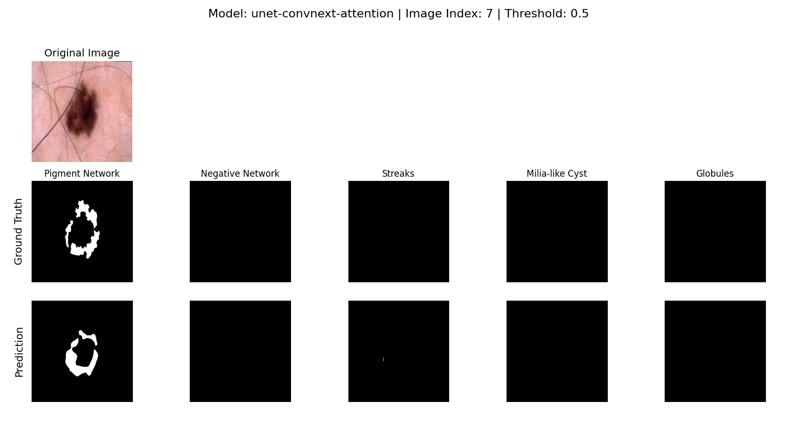

# Skin Cancer Segmentation  
_Final Project | Deep Learning Course, Technion_

## Overview

This repository contains the code and experiments for our final project in the Deep Learning course at the Technion. The goal of this project is to develop a state-of-the-art deep learning model for **automatic segmentation of skin lesion attributes** in dermoscopic images, with the broader aim of assisting early melanoma detection.

We participated in the ISIC 2018 Challenge (Task 2: Lesion Attribute Detection), working to segment five clinically important dermoscopic attributes:
- Pigment network
- Negative network
- Streaks
- Milia-like cysts
- Globules (dots)

Our best model achieved a **top-7 leaderboard result** on the ISIC 2018 Task 2 challenge, demonstrating strong performance compared to international teams and established methods.

## Project Highlights

- **Modern U-Net Variants:** Implemented and compared classic U-Net, Residual U-Net, Attention U-Net, and a novel U-Net with a ConvNeXt-Tiny encoder plus residual and attention blocks in the decoder.
- **Advanced Training Pipeline:** Extensive experiments with loss functions (Dice, Jaccard, BCE), optimizers, learning rate schedulers, and data augmentation.
- **Open, Reproducible Science:** All code and configs are included. Experiments are tracked via YAML configuration files for reproducibility.
- **Competitive Results:** Our ConvNeXt-based model achieved a test Dice score of 0.3213 and Jaccard index of 0.2052 on the ISIC 2018 challenge test set.


## Dataset

We use the [ISIC 2018 Task 2](https://paperswithcode.com/dataset/isic-2018-task-2) dataset:
- **2594 training images** (RGB, variable sizes, with 5 attribute masks per image)
- **100 validation images** (for model selection)
- **1000 test images** (for challenge submission)

Each image has up to 5 binary masks, one per lesion attribute.  
**Note:** The dataset is highly imbalanced — some attributes are very rare.

## Challenge Example

The following image illustrates an example from the ISIC 2018 challenge: the original dermoscopic image alongside its optimal attribute segmentation masks.

<p align="center">
  
</p>
*Figure: Example of an ISIC 2018 challenge image and its optimal segmentation.*

## Data Distribution

The ISIC 2018 Task 2 dataset is highly imbalanced across the five target attributes. The following pie charts illustrate the distribution of attribute masks in the training and validation sets:

**Training Set Distribution:**
<p align="center">
  
</p>
*Figure: Distribution of attribute masks in the ISIC 2018 training set. Most attributes are rare, making the segmentation task particularly challenging.*

**Validation Set Distribution:**
<p align="center">
  
</p>
*Figure: Distribution of attribute masks in the ISIC 2018 validation set. The imbalance is also evident in the validation data.*


## Getting Started

### Installation

1. **Clone the repository:**
   ```bash
   git clone https://github.com/your-username/skinCancerSegmentation.git
   cd skinCancerSegmentation
   ```

2. **Set up the environment:**  
   Recommended: use Conda or virtualenv. Install required packages:
   ```bash
   pip install -r requirements.txt
   ```

3. **Prepare the data:**  
   Download the ISIC 2018 Task 2 data and place it in the appropriate data folder. The folder structure should be:
   ```
   data/
     train/
     val/
     test/
     ...
   ```

---

## Configuration Options

All training, validation, and model settings are specified via a YAML config file (see examples in `model_params/unet_convnext_configs/`). Below are the main options you can tune:

| Parameter         | Description |
|-------------------|-------------|
| `epochs`          | Number of training epochs (e.g., 10, 40, 100). |
| `batch_size`      | Batch size (e.g., 4, 8, 16, 32, 64). |
| `lr`              | Learning rate (e.g., 0.001, 0.0001, 0.003). |
| `optimizer`       | Optimizer: `adam`, `adamw`, `sgd`, `rmsprop`, `adabelief`, `adagrad`. |
| `scheduler`       | LR scheduler: `reduce_lr`, `cosine`, `cosine_restart`, `step`, `exp`, `onecycle`. |
| `weight_decay`    | Weight decay for regularization (e.g., 0.0, 1e-5, 1e-8). |
| `momentum`        | Momentum (used with some optimizers, e.g., SGD, RMSProp). |
| `init`            | Weight initialization: `xavier`, `kaiming`, `orthogonal`, `normal`, `none`. |
| `pretrained`      | Use pretrained weights for encoder (`true`/`false`). |
| `model`           | Model variant: `unet`, `unet-residual`, `unet-attention`, `unet-convnext-attention`. |
| `classes`         | Number of segmentation output classes (usually 5 for ISIC2018 Task 2). |
| `bilinear`        | Use bilinear upsampling (`true`) or transposed convolution (`false`). |
| `amp`             | Use mixed precision training (`true`/`false`). |
| `load`            | Path to checkpoint to resume training, or `null` to train from scratch. |
| `t_max`           | Cosine AnnealingLR: Number of epochs for a full cosine cycle. |
| `eta_min`         | Cosine AnnealingLR: Minimum learning rate. |

**Tip:**  
Each experiment is fully reproducible: all key training options and model hyperparameters are stored in your YAML config, and reflected in output file names for easy comparison.


## Training

You can train your model of choice with a specified configuration YAML file:
```bash
python train.py --yaml ./model_params/unet_convnext_configs/config1_unet_convnext.yaml
```
- Example configs are provided in `model_params/unet_convnext_configs/`.
- All training options (model type, scheduler, optimizer, batch size, etc.) are set via the YAML config.

---

## Testing

After training, evaluate your model on the test set using a saved checkpoint:
```bash
python test.py --checkpoint images/top3_convnext_regular_loss/2025-07-05_15-37-31_unet-convnext-attention_epoch23_best_0.2052_jaccard_reducelr.pth --yaml model_params/unet_convnext_configs/config1_unet_convnext.yaml
```
- Replace `--checkpoint` and `--yaml` with your own paths if different.

---

## Visualization

To visualize model predictions on a single image from the dataset:
```bash
python -m utils.visualize --checkpoint images/top3_convnext_regular_loss/2025-07-05_15-37-31_unet-convnext-attention_epoch23_best_0.2052_jaccard_reducelr.pth --yaml model_params/unet_convnext_configs/config1_unet_convnext.yaml --image-index 78 --train 0
```
- Use `--image-index` to specify which image to visualize.
- Use `--train 1` to visualize a training image, `--train 0` for a validation/test image.

### Results

- **Best model:** U-Net with ConvNeXt-Tiny encoder, residual and attention decoder  
  - Validation Dice: 0.2875 | Jaccard: 0.1829  
  - Test Dice: 0.3213 | Jaccard: 0.2052 (ISIC Challenge Test Set)

Graphs and qualitative results are available in the `figures/` folder and in the report.

## Training Progress

The following graph shows the **training and validation score as a function of epochs** for our best-performing model:


*Figure 1: Train and validation Dice/Jaccard scores over epochs.*

## Training Experiments

During this project, we trained multiple U-Net-based models with a variety of architectures and hyperparameters. Each training run used 15 epochs (unless otherwise specified), and the hyperparameters are reflected in the filenames of the result plots. We compared the following:

- **U-Net (baseline)**
- **U-Net with Residual Blocks**
- **U-Net with Attention**
- **U-Net with ConvNeXt encoder (frozen and fine-tuned)**

Below you can see training progress plots (Dice and Jaccard vs Step) for each configuration.

---

### U-Net (fine-tune)
- Cosine LR Scheduler  
  
- OneCycle LR Scheduler  
  

---

### Unet residual

- Cosine LR Scheduler (60 epochs)  
  
- OneCycle LR Scheduler (60 epochs)  
  

---

### Unet-attention

- OneCycle, combined loss (60 epochs)  
  
- OneCycle, dice loss (60 epochs)  
  

**Tweaks/More Experiments:**
- Cosine, Adam, 15 epochs  
  
- Cosine Restart, Adam, 15 epochs  
  
- Step, Adam, BCE+Dice+Jaccard loss, 60 epochs  
  
- Step, Adam, 60 epochs  
  

---

### ConvNeXt with Encoder Frozen

- OneCycle, Adam, 30 epochs  
  
- Step, Adam, 30 epochs  
  

---
### ConvNeXt (fine-tuned encoder) — 100 epochs

- **OneCycle, Adam**  
  

- **ReduceLR, Adam**  
  

- **Step, Adam**  
  

---
**Note:** Each image filename contains the key training hyperparameters (scheduler, optimizer, learning rate, and epochs).

## Qualitative Results

Below are example predictions of our best model on two different test images from the ISIC 2018 dataset. Each shows the original dermoscopic image, the ground truth attribute masks, and the corresponding predicted masks produced by our U-Net ConvNeXt-Attention model.

<div align="center">



*Figure 2: Model prediction vs ground truth on a test image (ISIC 2018).*

<br/>


*Figure 3: Model prediction vs ground truth on another test image (ISIC 2018).*

</div>

## Architecture

- **Baseline U-Net**: Standard U-Net for medical image segmentation
- **Residual U-Net**: U-Net with residual blocks in encoder/decoder
- **Attention U-Net**: U-Net with attention gates on skip connections
- **ConvNeXt U-Net**: Pretrained ConvNeXt-Tiny encoder, attention & residual decoder

All models output a 5-channel mask (one per attribute) for each input image.

## Augmentation

Augmentations used (during training):
- Random horizontal & vertical flips
- Rotations
- Channel-wise normalization (mean/std from ISIC data)

## Citation & Acknowledgments

### ISIC 2018 Dataset

If you use this code or dataset, please cite:

HAM10000 Dataset: (c) by ViDIR Group, Department of Dermatology, Medical University of Vienna; https://doi.org/10.1038/sdata.2018.161

MSK Dataset: (c) Anonymous; https://arxiv.org/abs/1710.05006; https://arxiv.org/abs/1902.03368

[1] Noel Codella, Veronica Rotemberg, Philipp Tschandl, M. Emre Celebi, Stephen Dusza, David Gutman, Brian Helba, Aadi Kalloo, Konstantinos Liopyris, Michael Marchetti, Harald Kittler, Allan Halpern: "Skin Lesion Analysis Toward Melanoma Detection 2018: A Challenge Hosted by the International Skin Imaging Collaboration (ISIC)", 2018; https://arxiv.org/abs/1902.03368

[2] Tschandl, P., Rosendahl, C. & Kittler, H. The HAM10000 dataset, a large collection of multi-source dermatoscopic images of common pigmented skin lesions. Sci. Data 5, 180161 doi:10.1038/sdata.2018.161 (2018).

Other references and model architectures cited in the report.

### Credits

- Project authors: **Nathan Adda** and **Omri Mishriki**
- Deep Learning Course, Technion

---

## License

For educational purposes only.  
Dataset subject to ISIC 2018 terms of use.

